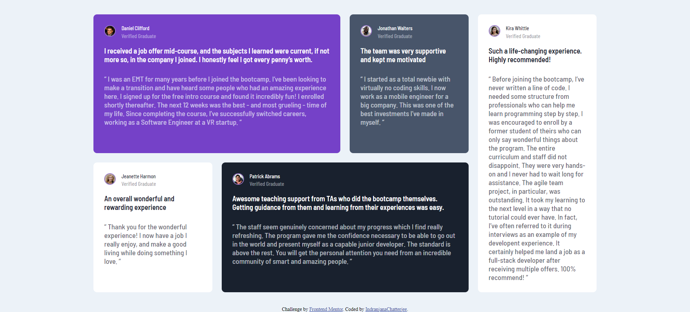

# Frontend Mentor - Testimonials grid section solution

This is a solution to the [Testimonials grid section challenge on Frontend Mentor](https://www.frontendmentor.io/challenges/testimonials-grid-section-Nnw6J7Un7). Frontend Mentor challenges help you improve your coding skills by building realistic projects. 

### Screenshot

### Links

- Solution URL: [solution URL](https://github.com/IndranjanaChatterjee/Testimonials-grid-section)
- Live Site URL: [live site URL](https://testimonials-sol.netlify.app/)

## My process

### Built with

- Semantic HTML5 markup
- CSS custom properties
- Flexbox
- CSS Grid
- Mobile-first workflow

## Author

- Frontend Mentor - [IndranjanaChatterjee](https://www.frontendmentor.io/profile/IndranjanaChatterjee)

